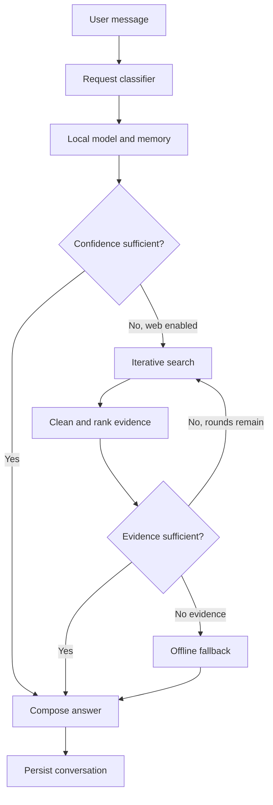

# Mini-GPT Agent

A local-first conversational AI project that combines a compact Transformer checkpoint with persistent memory, bounded web research, evidence retrieval, a FastAPI service, and an installable Progressive Web App.

> [!IMPORTANT]
> This repository is an educational AI engineering project, not a replacement for a production-grade large language model. The bundled checkpoint is intentionally treated as low-confidence for factual questions unless relevant evidence is available.

## Key capabilities

- Local text generation using the bundled TensorFlow Mini-GPT checkpoint
- Automatic routing between local knowledge, cached knowledge, and live web research
- Bounded multi-round retrieval with explicit confidence and stopping criteria
- Wikipedia and general web search providers with graceful network failure handling
- Extractive evidence selection with source attribution
- Persistent SQLite conversation history, user-approved memories, and document cache
- Explicit memory controls: list, create, and delete stored facts
- Clarifying questions for underspecified prompts
- Persian and English prompt handling
- FastAPI backend with validated request schemas
- Responsive Progressive Web App for Windows, iPhone, and iPad
- Lightweight mode that runs without TensorFlow
- Docker and Docker Compose support
- Automated tests for routing, retrieval, memory, and fallback behavior

## Architecture



### Request lifecycle

1. The API validates the incoming message and session identifier.
2. The agent checks explicit user memories and cached documents for relevant context.
3. The local model produces an initial answer with a deliberately conservative confidence score.
4. Factual questions are routed to web retrieval when local confidence is insufficient and web access is enabled.
5. Search results are cleaned, deduplicated, ranked, and cached in SQLite.
6. Retrieval stops when the minimum evidence threshold is reached, the configured round limit is exhausted, or the network is unavailable.
7. The final answer includes its operating mode, confidence score, search-round count, and source links.

## Repository layout

```text
mini-gpt/
├── agent/                 Agent orchestration, retrieval, memory, and personality
├── checkpoints/           Bundled TensorFlow checkpoint
├── data/                  Original training text
├── outputs/               Serialized tokenizer
├── scripts/               Application entry points
├── src/                   Transformer, tokenizer, training, and inference code
├── tests/                 Automated behavior tests
├── web/                   Progressive Web App assets
├── api.py                 FastAPI application
├── Dockerfile             Container image definition
├── docker-compose.yml     Local container orchestration
├── start_windows.bat      Windows launcher
└── requirements*.txt      Full, lightweight, and development dependencies
```

## Requirements

- Python 3.11 recommended
- Windows 10/11, Linux, or macOS
- Approximately 3 GB of free disk space for the full TensorFlow environment
- Internet access only when live research is enabled

## Windows quick start

Clone the production branch:

```powershell
git clone --branch mini-gpt-agent-v1 --single-branch https://github.com/aminbakhtiari777/mini-gpt.git
cd mini-gpt
```

Create and activate a virtual environment:

```powershell
py -3.11 -m venv .venv
Set-ExecutionPolicy -Scope Process -ExecutionPolicy Bypass
.\.venv\Scripts\Activate.ps1
```

Install the full runtime and start the application:

```powershell
python -m pip install --upgrade pip
pip install -r requirements.txt
python scripts\run.py
```

Open [http://localhost:8000](http://localhost:8000).

After the initial installation, double-click `start_windows.bat` to start the application. Keep the terminal window open while the service is in use.

## Lightweight installation

The lightweight environment runs the API, PWA, memory, and deterministic fallback without loading the TensorFlow checkpoint:

```powershell
pip install -r requirements-lite.txt
python scripts\run.py
```

This mode is useful for UI development and low-resource environments. It does not provide neural text generation.

## Access from iPhone or iPad

The Apple device and the Windows computer must be connected to the same trusted Wi-Fi network.

1. Start Mini-GPT on Windows.
2. Run `ipconfig` and locate the Wi-Fi adapter's IPv4 address.
3. Open `http://<WINDOWS-IP>:8000` in Safari, for example `http://192.168.1.15:8000`.
4. Select **Share → Add to Home Screen**.

The PWA provides an app-like interface, but inference still runs on the Windows host. The host must remain powered on, connected to the network, and awake.

## Docker

```bash
docker compose up --build
```

The SQLite database is stored in a named Docker volume, so memories survive container replacement.

## CLI mode

```bash
python -m agent.cli
```

Available commands:

- `/online` — enable web research
- `/offline` — disable web research
- `/quit` — exit the session

## Configuration

The application is configured through environment variables.

| Variable | Default | Purpose |
| --- | ---: | --- |
| `MINIGPT_DB_PATH` | `runtime/minigpt.db` | SQLite database location |
| `MINIGPT_MAX_SEARCH_ROUNDS` | `3` | Maximum retrieval rounds per request |
| `MINIGPT_RESULTS_PER_ROUND` | `4` | Maximum search results per round |
| `MINIGPT_MIN_SOURCES` | `2` | Minimum evidence sources before early stopping |
| `MINIGPT_MIN_CONFIDENCE` | `0.55` | Confidence threshold for local or retrieved answers |
| `MINIGPT_REQUEST_TIMEOUT` | `5` | Network timeout in seconds |
| `MINIGPT_OFFLINE` | `0` | Set to `1` to disable web research globally |
| `MINIGPT_REMEMBER` | `0` | Set to `1` to persist every user message as memory |

Example PowerShell configuration:

```powershell
$env:MINIGPT_OFFLINE="1"
$env:MINIGPT_MAX_SEARCH_ROUNDS="2"
python scripts\run.py
```

## API

| Method | Endpoint | Description |
| --- | --- | --- |
| `GET` | `/api/health` | Service readiness check |
| `POST` | `/api/chat` | Submit a chat request |
| `GET` | `/api/memories` | List explicit long-term memories |
| `POST` | `/api/memories` | Store a memory manually |
| `DELETE` | `/api/memories/{id}` | Delete a memory |

Example chat request:

```bash
curl -X POST http://localhost:8000/api/chat \
  -H "Content-Type: application/json" \
  -d '{"message":"What is retrieval-augmented generation?","session_id":"demo","allow_web":true}'
```

Example response shape:

```json
{
  "answer": "...",
  "mode": "web",
  "confidence": 0.78,
  "search_rounds": 2,
  "needs_clarification": false,
  "learned": false,
  "sources": [
    {
      "title": "Source title",
      "url": "https://example.com",
      "provider": "web"
    }
  ]
}
```

## Memory and privacy

- Conversation history, explicit memories, and cached documents are stored locally in SQLite.
- Long-term personal memory is opt-in by default.
- The database is stored as plaintext and should be protected using normal operating-system access controls.
- Use `GET /api/memories` to audit stored facts and `DELETE /api/memories/{id}` to remove them.
- Live research sends the search query to the configured external search providers.

## Testing

Install development dependencies and run the test suite:

```bash
pip install -r requirements-dev.txt
pytest -q
```

The current suite covers text cleaning, evidence ranking, persistent memory, explicit memory extraction, local routing, web-search routing, bounded retries, network fallback, clarification behavior, multi-provider retrieval, and offline cached knowledge.

## Security considerations

- The development server has no authentication layer.
- Do not expose port `8000` directly to the public internet.
- Restrict access to a trusted private network or place the service behind an authenticated HTTPS reverse proxy.
- Web content is untrusted input. The retrieval layer strips HTML and limits retained content, but production deployments should add stricter URL validation, allowlists, rate limiting, and observability.
- Keep dependencies patched and review container images before public deployment.

## Model limitations

The bundled checkpoint contains **5,216,912 parameters** and was trained on a small story-oriented corpus. It is suitable for demonstrating Transformer inference and agent orchestration, but it does not contain broad or reliable world knowledge.

For that reason:

- Raw checkpoint output is capped at low factual confidence.
- High-confidence greetings are deterministic.
- Low-confidence factual questions trigger retrieval when web access is available.
- The agent reports insufficient knowledge instead of presenting unsupported local output as fact.
- Retrieved answers are extractive and may require additional synthesis for advanced use cases.
- Emotional behavior is a transparent software persona, not genuine emotion or consciousness.

## Production roadmap

- Replace the educational checkpoint with a stronger quantized instruction model
- Add a vector index and embedding-based retrieval
- Add authenticated multi-user sessions
- Add HTTPS termination and request rate limiting
- Add structured logging, tracing, and retrieval evaluation
- Add background document ingestion and memory review workflows
- Export a mobile-optimized model for native on-device inference
