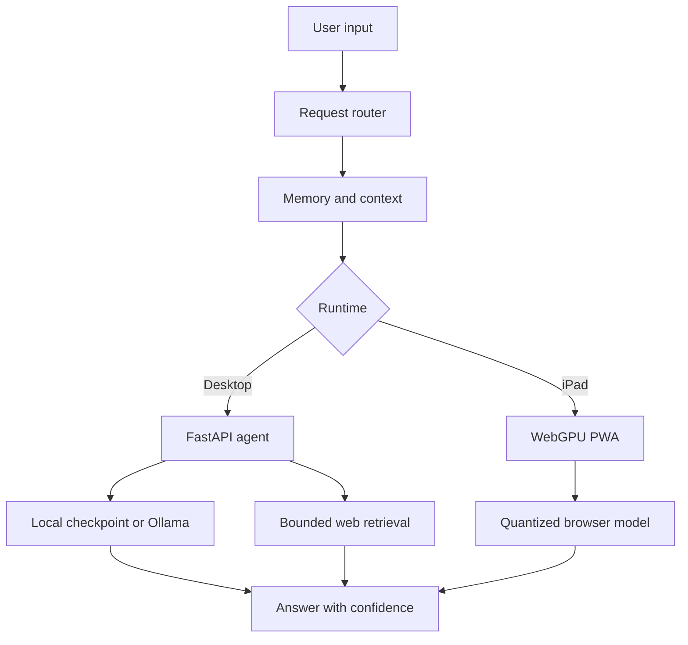

# Zamis Local AI Lab

### Resource-Aware Bilingual Voice Assistant Prototype

[](#project-status)
[](https://www.python.org/)
[](https://fastapi.tiangolo.com/)
[](docs/)
[](#capabilities)

**Zamis Local AI Lab** is an AI-engineering portfolio project exploring how far a bilingual, local-first assistant can go across two constrained environments:

1. a Python/FastAPI agent with memory, retrieval, and optional Ollama inference;
2. an installable iPad Progressive Web App running a quantized language model through WebGPU.

The project demonstrates model integration, agent routing, explicit memory, bounded web retrieval, voice interaction, PWA engineering, offline fallbacks, and honest handling of resource limits.

> [!IMPORTANT]
> This repository is preserved as an **archived engineering prototype and case study**. The iPad edition is not recommended as a daily assistant: browser memory limits and the small on-device model prevent ChatGPT-level comprehension and reliability.

## Project status

| Area | Status | Result |
| --- | --- | --- |
| Python agent architecture | Complete prototype | FastAPI, memory, retrieval, CLI, and Docker paths implemented |
| iPad PWA | Complete prototype | Installable bilingual UI, WebGPU inference, local storage, voice experiments |
| Automated behavior suite | Implemented | 23 Python behavior tests plus a JavaScript voice smoke test |
| Production deployment | Not pursued | Requires stronger compute or a funded secure cloud backend |
| Repository status | **Archived / portfolio** | Source remains available for review and future continuation |

## What the project demonstrates

- Designing a compact Transformer training and inference pipeline
- Building an agent around a weak model instead of trusting raw generations
- Confidence-based routing between local inference, cached knowledge, and web evidence
- Persistent SQLite memory with explicit create/list/delete controls
- Multi-turn context for optional Ollama sessions
- Persian and English conversational handling
- iPad WebGPU and WebLLM experimentation
- Speech-to-text, text-to-speech, wake-word, and audio-state prototyping
- Progressive Web App caching and installability
- FastAPI request validation and health reporting
- Docker packaging and lightweight/full dependency profiles
- Automated tests for memory, routing, retrieval, fallbacks, and voice utilities

## Architecture



The desktop path is the more complete agent system. The iPad path is a research prototype used to measure the practical limits of browser-based on-device AI.

## Capabilities

### Agent backend

- Local educational Transformer checkpoint
- Optional Ollama conversational model
- Bounded multi-provider search and evidence ranking
- Explicit long-term memory and recent conversation history
- Cached knowledge for offline reuse
- Honest low-confidence fallback behavior
- Persian/English request handling
- REST API and CLI interfaces

### iPad research prototype

- Quantized `Qwen2.5-3B-Instruct-q4f16_1-MLC` through WebLLM/WebGPU
- Local IndexedDB conversation and explicit memory
- Persian/English chat interface
- Wake-word and continuous-listening experiments
- Local/browser speech fallback paths
- File and PDF text extraction prototype
- Installable PWA shell and offline asset cache

## Resource profiles

| Profile | Practical requirements | Intended use |
| --- | --- | --- |
| Lightweight backend | Python 3.11, about 1–2 GB RAM, under 1 GB disk | API/UI and deterministic routing without neural generation |
| Full educational backend | Python 3.11, 4–8 GB RAM, about 3 GB free disk | TensorFlow checkpoint, memory, retrieval, and tests |
| Recommended local backend | 8–16 GB RAM, 8–12 GB free disk, Ollama | More natural local conversation using a quantized instruction model |
| iPad WebGPU prototype | Modern WebGPU-capable iPad, roughly 2.5 GB model download, several GB runtime memory | Demonstration only; sensitive to Safari memory pressure |
| Production-quality assistant | Authenticated HTTPS backend, API/model budget, monitoring, rate limits, secure secrets | Strong reasoning, reliable multilingual speech, and live tools |

Resource numbers are operational estimates and vary by model build, browser, OS, context length, and inference engine.

## Why the iPad edition was archived

The prototype successfully proved that a bilingual model can run directly inside Safari, but it also exposed the real engineering boundary:

- a 3B-class quantized model fits more easily but produces weak reasoning and inconsistent Persian;
- larger local models increase memory pressure and can be evicted or terminated by Safari;
- browser caches may be removed by the operating system;
- initializing model weights is still required after reopening, even when no re-download occurs;
- Siri-like background listening is not available to an ordinary PWA;
- high-quality speech, web tools, and reasoning require a secure backend and ongoing compute budget.

This is a useful project outcome, not a hidden failure: the implementation established which components can remain local and which require stronger infrastructure.

## Repository map

```text
mini-gpt/
├── agent/                 Orchestration, retrieval, memory, and personality
├── api/                   Optional serverless chat and transcription prototypes
├── checkpoints/           Educational TensorFlow checkpoint
├── data/                  Training corpus
├── docs/                  Archived iPad PWA and portfolio landing page
├── outputs/               Serialized tokenizer
├── scripts/               Runtime and dependency-free test runner
├── src/                   Transformer training and inference code
├── tests/                 Python behavior tests and voice smoke test
├── web/                   FastAPI-served web client
├── api.py                 FastAPI application
├── Dockerfile             Container definition
└── docker-compose.yml     Local orchestration
```

## Reproducing the tests

The dependency-free runner executes the 23 Python behavior tests without requiring pytest:

```bash
python scripts/run_test_suite.py
```

The browser voice utility smoke test runs with Node.js:

```bash
node tests/voice-smoke.mjs
```

The standard development route remains available:

```bash
pip install -r requirements-dev.txt
pytest -q
```

## Optional desktop run

```bash
git clone --branch mini-gpt-agent-v1 --single-branch https://github.com/aminbakhtiari777/mini-gpt.git
cd mini-gpt
python -m venv .venv
pip install -r requirements-lite.txt
python scripts/run.py
```

Open `http://localhost:8000`. The full TensorFlow environment uses `requirements.txt`; Ollama can be enabled through the variables documented in [`PROJECT_REPORT.md`](PROJECT_REPORT.md).

## Remove the iPad prototype completely

1. Touch and hold the **Zamis** Home Screen icon.
2. Select **Remove App → Delete App**.
3. Open **Settings → Apps → Safari → Advanced → Website Data**.
4. Search for `aminbakhtiari777.github.io` and delete that entry.

Deleting the website entry removes the downloaded model, local conversations, memories, and PWA settings from that iPad.

## Security notes

- Never place an API key in browser JavaScript or commit it to Git.
- The development FastAPI server is not intended for direct public exposure.
- Production use requires authentication, HTTPS, rate limiting, logging, and secret management.
- Retrieved web content must be treated as untrusted input.
- Personal memory should remain explicit, inspectable, and deletable.

## Future continuation requirements

If sufficient resources become available, the next version should use:

- a secure hosted reasoning model or a workstation-class local model;
- realtime multilingual transcription and natural speech synthesis;
- a vector database for semantic memory;
- authenticated user/device sessions;
- source-grounded web tools;
- structured evaluation for Persian comprehension, latency, and hallucination rate;
- a native iPad application if background audio is a requirement.

The implementation history and detailed engineering findings are documented in [`PROJECT_REPORT.md`](PROJECT_REPORT.md).

## Author

**Amin Bakhtiari**<br>
AI engineering learner and project creator — architecture, implementation direction, testing, and product iteration.
